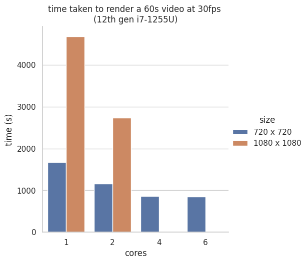

# lyapunov
## Experiments with Marimo, Numpy and Multiprocessing SharedMemory

The [Lyapunov Fractal](https://en.wikipedia.org/wiki/Lyapunov_fractal) is calculated
from repeated iterations of the [Logistic Map](https://en.wikipedia.org/wiki/Logistic_map):

$$ \Large{x_{n+1} = r_{n}x_{n}(x_{n}-1)} $$

where at each iteration $r_{n}$ takes values from some repeated sequence, for 
example $AABAB$. For each point in an image $A$ and $B$ take the values of
the $x$ and $y$ coordinates. For a large number of iterations $N$, the Lyapunov
exponent $\lambda$ is found for each point, and coloured accordingly:

$$ \Large{\lambda = \dfrac{1}{N}\sum_{n=1}^{N}|r_{n}(1-2x_{n})|} $$

Code to play with Lyapunov fractals and animate them has been implemented as a [Marimo notebook](https://marimo.io/).
To experiment with it, either start a [virtualenv](https://docs.python.org/3/library/venv.html),
clone this repo, install the dependencies and then run the notebook...

```bash
mkdir marimo_env
python3 -m venv marimo_env
source ./marimo_env/bin/activate
git clone https://github.com/augeas/lyapunov.git
cd lyapunov
pip install -r requirements.txt
marimo edit
```

...or, since Marimo enables [export to web-assembly](https://docs.marimo.io/guides/wasm/) via
[Pyodide](https://pyodide.org/en/stable/), you play with a web-app
based on the code at [https://augeas.github.io/lyapunov](https://augeas.github.io/lyapunov).
Since the code uses Numpy, Pillow and Matplotlib, all of which are packaged by default by [Pyodide](https://pyodide.org/en/stable/),
there is no need to resort to [micropip](https://micropip.pyodide.org/en/latest/project/usage.html).

It is not yet possible to use Marimo notebooks like regular Python modules directly, but if they are written
with care, they can be converted to .py files that *can* be imported:

```bash
marimo export script lyapunov.py -o lyap.py
```

One might generate the "[Zircon Zity](https://en.wikipedia.org/wiki/Lyapunov_fractal#/media/File:Lyapunov-fractal.png)"
image on the [Wikipedia page](https://en.wikipedia.org/wiki/Lyapunov_fractal) with:

```python
from lyap import lyapunov_img
lyapunov_img('BBBBBBAAAAAA',
    x_min=2.5, x_max=3.4, y_min=3.4, y_max=4.0, its=400, width=900, height=600,
palette='managua').save('zircon_zity.png')
```


The repeated sequence of coeffecients can extended beyond $A$ and $B$. If a third,
$C$, that varies over time is added, then an animation can be produced. More pleasingly,
if there are $C$ and $D$ coefficients in a sequence, they can rotate in a circle so the
animation can return to the start and repeat. The individual images are joined togther
in a video via [ffmpeg](https://ffmpeg.org/). This illustrate how Marimo notebooks can
be [run as scripts](https://docs.marimo.io/guides/scripts/), including the passing of
parameters:

```bash
python lyapunov.py --seq=ACDBCD --fname=ACDBCD_1080.mp4 --width=1080  --height=1080 --xc 2.95 --yc 2.95 --rad=0.25 --pal twilight --cores=2
```

Rather than write each image to disk before generating the video, they are
streamed to [ffmpeg](https://ffmpeg.org/) via standard input and the
[`subprocess`](https://docs.python.org/3/library/subprocess.html) module from the Python
standard library. Here, `cores` refers to the number of processes used to generate the frames,
another Python process is required to pass the images to [ffmpeg](https://ffmpeg.org/),
which has a process of its own.

### Investigating Parallel Processing and Shared Memory

1800 images are required for 60s of video at 30 frames-per-second. They are
generated in parallel with
[`multiprocessing.Pool`](https://docs.python.org/3/library/multiprocessing.html#module-multiprocessing.pool).
This introduces complexity when avoiding performance bottlenecks from sending
large Numpy arrays to and from functions passed to a `Pool`, or using shared memory.
Computing each image requires arrays for $A$ and $B$ coefficients and the sequence in which
they are applied, which are constant for all images. The $C$ and $D$ coeffecients vary for
each image, but are constant over each individual image; arrays to hold them can be generated
by passing in a simple tuple. If the constant arrays are in the Python interpreter's
global state, they will be shared and available to every process in a `Pool`
via "copy-on-write". One problem with this is the coefficients cannot be modified
within a function without unpleasant use of the `global` keyword. Defining them within a
function, and passing an inner function that can access them to a `Pool` won't work
directly, `multiprocessing` will complain. The third-party
[`multiprocess`](https://pypi.org/project/multiprocess/) library will
allow this, but it means adding another dependency. There still remains the problem
of passing the computed images back. Returning it as a hightly compressed PNG image,
in the hope that serializing and deserialising it will not harm performance too much
might not be ideal for larger images, and leaves [`ffmpeg`](https://ffmpeg.org/) with the pointless task of
decompressing the image again.

"Explicit" being better than "Implicit", it may be better to pass Numpy arrays backed
by [`multiprocessing.SharedMemory`](https://docs.python.org/3/library/multiprocessing.shared_memory.html)
buffers. The IDs of the buffers and the shape of the array need to be passed to the child processes.
Since one buffer will be needed to return each image, the sequence of images is divided
into chunks, and a set of outpuf buffers is used in rotation.
[`functools.partial`](https://docs.python.org/3/library/functools.html#functools.partial)
is used to produce a function that only has the $C$ and $D$ coeffecients and the name of the 
output buffer to use as arguments. There are choices of how to present the function and its
sequence of arguments to the `Pool`. If
[`Pool.starmap`](https://docs.python.org/3/library/multiprocessing.html#multiprocessing.pool.Pool.starmap)
is used, each chunk of images will be computed synchronously. The [`ffmpeg`](https://ffmpeg.org/) process will be
mostly idle as each chunk is generated, then very active, with the other processes idle until
the chunk has been consumed. It is better to use the lazily-evaluated
[`Pool.imap`](https://docs.python.org/3/library/multiprocessing.html#multiprocessing.pool.Pool.imap).
The [`ffmpeg`](https://ffmpeg.org/) process remains somewhat active, but the processes generating
the images are constantly active.
 
The script scales that it is worthwhile using 2-4 cores:

